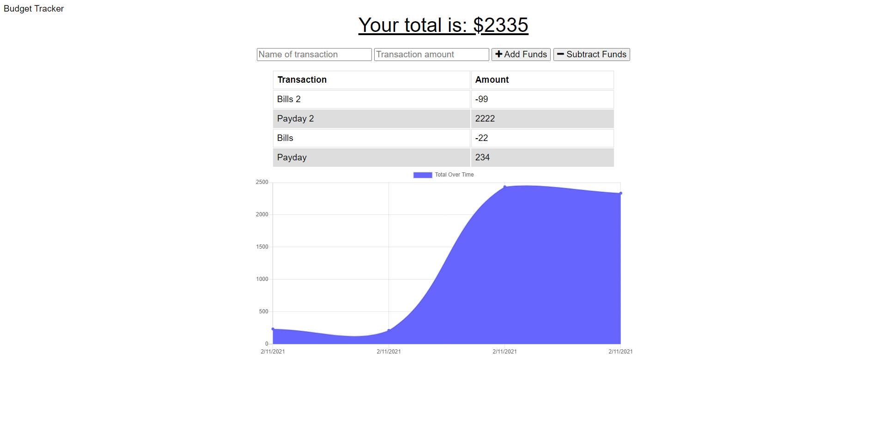

# Budget Tracker

## Description

The goal of this project was to create a progressive web app that allows the user to keep track of their budget.  The user can add or subtract from their budget easily with buttons, and can see transactions visually with a chart.

## Installation

All functionality of this project is contained within the deployed webpage itself.  Users can navigate to the following address to experience the application:
https://fierce-mesa-48969.herokuapp.com/

## Usage

The user can use the simplified form and buttons to create transactions to add or subtract from their budget.

## Credits

The Georgia Tech Boot Camp

## License

MIT License

Copyright (c) 2021 Paul Keldsen

Permission is hereby granted, free of charge, to any person obtaining a copy
of this software and associated documentation files (the "Software"), to deal
in the Software without restriction, including without limitation the rights
to use, copy, modify, merge, publish, distribute, sublicense, and/or sell
copies of the Software, and to permit persons to whom the Software is
furnished to do so, subject to the following conditions:

The above copyright notice and this permission notice shall be included in all
copies or substantial portions of the Software.

THE SOFTWARE IS PROVIDED "AS IS", WITHOUT WARRANTY OF ANY KIND, EXPRESS OR
IMPLIED, INCLUDING BUT NOT LIMITED TO THE WARRANTIES OF MERCHANTABILITY,
FITNESS FOR A PARTICULAR PURPOSE AND NONINFRINGEMENT. IN NO EVENT SHALL THE
AUTHORS OR COPYRIGHT HOLDERS BE LIABLE FOR ANY CLAIM, DAMAGES OR OTHER
LIABILITY, WHETHER IN AN ACTION OF CONTRACT, TORT OR OTHERWISE, ARISING FROM,
OUT OF OR IN CONNECTION WITH THE SOFTWARE OR THE USE OR OTHER DEALINGS IN THE
SOFTWARE.